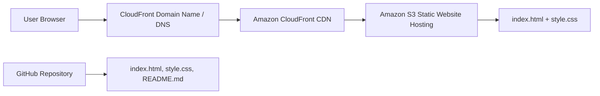

# SkyHigh Portfolio Project 1 — Pharmacy + IT Portfolio Website on AWS

This is my first SkyHigh Academy portfolio project. I built and deployed a static personal portfolio website using AWS S3 and CloudFront.

The website highlights my background as a PharmD student while also showing my growing skills in information technology, cloud computing, Linux, Git, HTML, CSS, and AWS.

**Live URL:** https://dpc7d0tjgfl9f.cloudfront.net/
## Architecture Diagram

## How the Architecture Works

Users visit my CloudFront HTTPS URL in their browser. The CloudFront domain name acts as the DNS endpoint for this project. CloudFront serves the website globally and securely using HTTPS. The website files are stored in Amazon S3 using static website hosting. My project code is stored and documented in GitHub.

## What I Built

- A personal portfolio website using HTML and CSS
- An S3 bucket configured for static website hosting
- A CloudFront distribution for HTTPS and global website delivery
- A public GitHub repository with project files and documentation

## Pharmacy + IT

I designed this portfolio to connect my pharmacy background with information technology and cloud computing. My goal is to show how pharmacy skills such as medication safety, documentation, problem solving, and patient care can transfer into healthcare technology, pharmacy informatics, managed care, and digital health roles.

## Skills Highlighted

### Pharmacy and Healthcare Skills

- Medication therapy management
- Patient counseling
- Medication adherence support
- Clinical documentation
- Medication safety
- Drug information research
- Community pharmacy experience
- Acute care and ICU pharmacy exposure
- Prior authorization awareness
- Healthcare communication

### IT and Cloud Skills

- AWS S3
- AWS CloudFront
- Static website hosting
- Intending to pursue AWS certification
- HTTPS
- Content delivery networks
- Linux command line
- Bash basics
- Git and GitHub
- HTML and CSS
- Technical documentation
- Cloud cost awareness

## What I Learned

- How static websites are hosted in the cloud
- How S3 stores website files
- How CloudFront delivers content globally
- Why HTTPS matters for secure websites
- How to organize and document a technical project
- How to connect pharmacy experience with cloud technology
- How technical skills can support healthcare systems and medication-use processes

## Future Improvements

- Add a custom domain name
- Add an architecture diagram
- Add more pharmacy informatics and healthcare technology projects
- Add additional AWS projects as I complete them
- Improve the site design and add more portfolio sections
